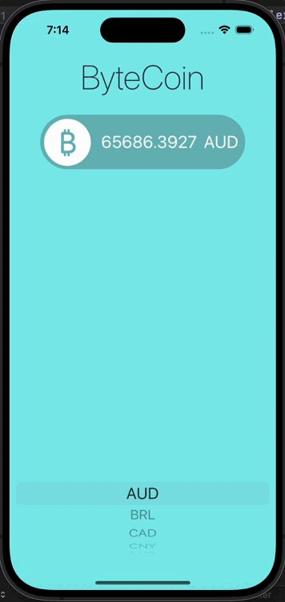

# ByteCoin 

## Goal

ByteCoin is a dynamic cryptocurrency price tracking application designed to provide users with real-time Bitcoin prices in various currencies. Utilizing an API, the app fetches up-to-date Bitcoin price data and presents it to users in a user-friendly interface. Key features of the app include:

## Real-Time Bitcoin Price Updates
ByteCoin leverages an API to fetch real-time Bitcoin price data, ensuring that users always have access to the most current information.

## Multi-Currency Support 
The app offers support for various currencies, allowing users to view Bitcoin prices in their preferred currency. Users can easily scroll through a list of available currencies to select the one they want to view.

## Interactive Scroller for Currency Selection
ByteCoin utilizes an interactive scroller to facilitate currency selection. Users can scroll through the list of available currencies and tap on their desired currency to view the corresponding Bitcoin price.

## User-Friendly Interface
ByteCoin features a clean and intuitive interface, making it easy for users to navigate and access the information they need. The app prioritizes simplicity and usability, ensuring a positive user experience.